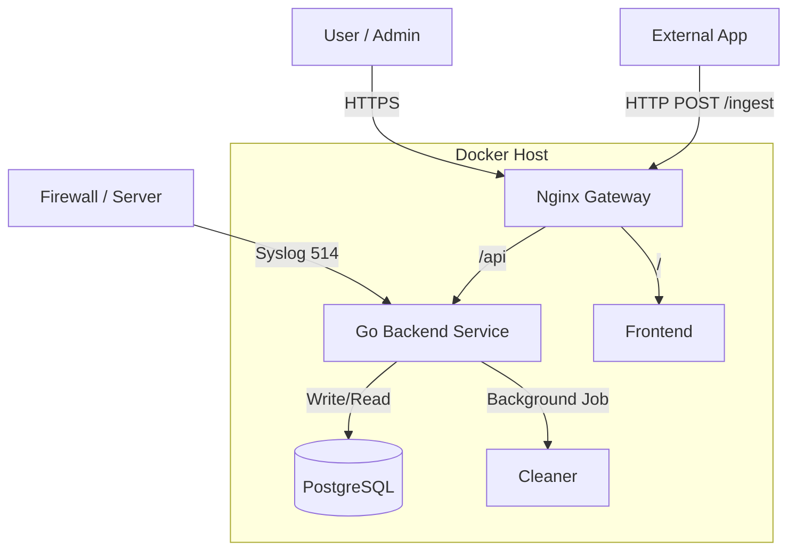

# System Architecture

## Overview
The Log Management System is a centralized platform designed to ingest, normalize, store, visualize, and alert on log data from various sources. It follows a Microservices-like architecture containerized with Docker.

## Components

1.  **Frontend (React + Vite)**:
    - Provides the user interface for Dashboard, Search, and Alert management.
    - Connects to the Backend API via Nginx (Reverse Proxy).
    - Authenticaties users via JWT.

2.  **Backend (Golang)**:
    - **API Server**: Handles REST API requests (Ingest, Query, Auth).
    - **Ingestor**:
        - **Syslog Server**: UDP/TCP listener on port 514.
        - **HTTP Ingest**: REST endpoint `/ingest` for JSON batch logs.
    - **Log Normalizer**: Converts various log formats into a standard `LogEntry` schema.
    - **Alert Engine**: Real-time evaluation of logs against user-defined rules.
    - **Retention Job**: Background worker to delete logs older than 7 days.

3.  **Database (PostgreSQL 15)**:
    - Stores logs in JSONB format for flexibility and indexing.
    - Stores Users, Tenants, and Alert Rules.
    - Implements **Row Level Security (RLS)** to ensure data isolation between tenants.

4.  **Gateway (Nginx)**:
    - Handles TLS termination (HTTPS).
    - Routes traffic to Frontend or Backend.
    - Serves static files.

## Data Flow Diagram

## Tenant Model
The system uses **Database-Level Multi-Tenancy** via Column Discriminator + Row Level Security (RLS).
- Every table (`logs`, `users`, `alerts`) has a `tenant_id` column.
- Go Backend sets the current tenant context in the SQL transaction.
- PostgreSQL enforces: `SELECT * FROM logs` returns ONLY rows belonging to that tenant.
